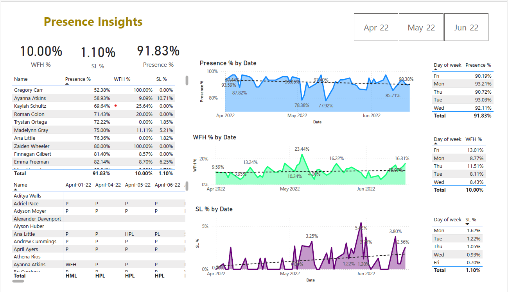
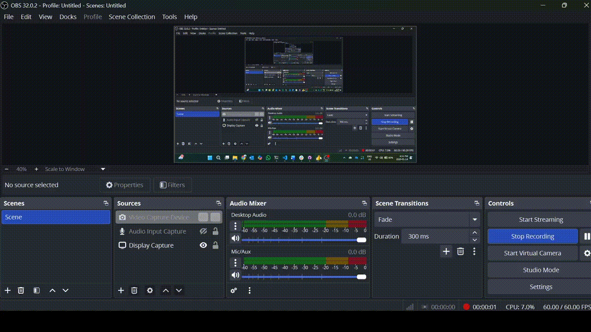

# Presence Insights Dashboard

---

## Table of Contents

1. [Project Scope](#project-scope)  
2. [Audience-Friendly Description](#audience-friendly-description)  
3. [Business Impact](#business-impact)  
4. [Problem Statement](#problem-statement)  
5. [Analysis Focus Areas](#analysis-focus-areas)  
6. [Dashboard & Visualizations](#dashboard--visualizations)  
7. [Demo View](#demo-view)  
8. [Key Insights](#key-insights)  
9. [How to Run](#how-to-run)  
10. [Next Steps](#next-steps)  
11. [License & Credits](#license--credits)

--- 

## Project Scope

The objective of this project is to analyze employee attendance data to uncover patterns in **work-from-home (WFH) preferences**, **presence trends**, and **leave behavior** over a three-month period. The analysis supports data-driven workforce planning and helps organizations optimize hybrid work policies.

---

## Audience-Friendly Description

This dashboard helps HR teams and managers understand when employees prefer to work remotely, how often they take leave, and how attendance trends vary across weekdays—enabling smarter scheduling and better resource allocation.

---

## Business Impact

- Improves workforce planning and scheduling  
- Supports data-driven hybrid work policies  
- Identifies attendance and leave trends early  
- Enhances operational efficiency  
- Reduces dependency on manual Excel tracking  

---

## Problem Statement

The dataset contains attendance records for **50+ employees**, captured across multiple Excel spreadsheets over a three-month period. The raw data includes inconsistencies, missing values, and varying formats that must be cleaned and standardized before meaningful analysis can be performed.

The goal is to extract actionable insights related to:
- Work-from-home preferences by weekday  
- Presence trends over time  
- Leave-taking behavior and patterns  

---

## Analysis Focus Areas

1. **Data Transformation and Cleaning**  
   - Standardized attendance statuses (P, WFH, SL, PL, HPL)  
   - Handled missing and inconsistent records  
   - Structured data for Power BI modeling  

2. **Work-from-Home Preferences**  
   - Identified most preferred WFH weekdays  
   - Analyzed WFH trends by date and week  

3. **Leave Patterns**  
   - Examined sick leave (SL) frequency  
   - Identified recurring leave days  
   - Analyzed correlation between WFH and leave  

4. **Insights and Recommendations**  
   - Provided actionable insights for workforce optimization  
   - Supported strategic decision-making for HR policies  
  

---

## Dashboard & Visualizations

**Dashboard Highlights:**
- Presence %, WFH %, and SL % KPIs  
- Presence, WFH, and SL trends by date  
- Day-of-week analysis  
- Employee-level attendance matrix  

---

## Demo View

*End-to-end Power BI dashboard walkthrough showcasing attendance, WFH trends, and leave behavior.*

---

## Key Insights

- **Overall Presence:** ~91.8% average presence across the period  
- **WFH Preference:** Higher adoption on Thursdays and Fridays  
- **Leave Trends:** Sick leave shows an upward trend toward later weeks  
- **Weekday Behavior:** Mondays and Tuesdays show higher in-office presence  

---

## How to Run

1. Open the attendance Excel files  
2. Load data into **Power BI Desktop**  
3. Apply Power Query transformations  
4. Refresh the dataset  
5. Publish to Power BI Service (optional)  

---

## Next Steps

1. Automate data refresh using SharePoint or OneDrive  
2. Extend analysis to monthly and quarterly trends  
3. Add department and role-based filtering  
4. Build predictive models for leave forecasting  
5. Integrate with HR systems for real-time tracking  

---

## License & Credits

- **License:** MIT License  
- **Credits:** Microsoft Power BI, Microsoft Excel  

